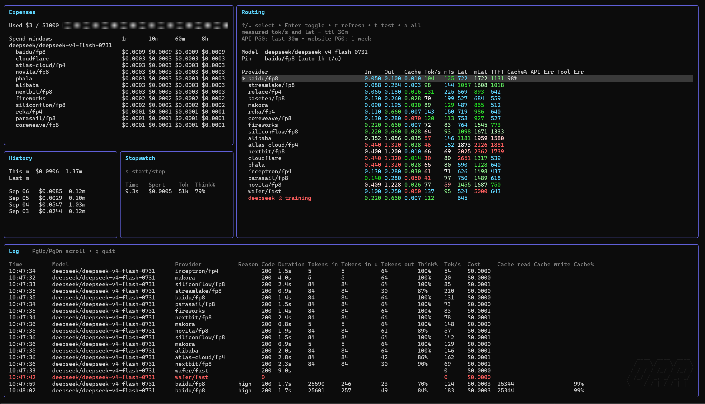

# open router router

`orr` is a local OpenRouter proxy. It keeps the model selected by your client
and applies provider preferences from `providers.yaml` to generation requests.

It gives you provider routing, manual pins, live performance and spend data, and
a terminal dashboard without recording prompts or API keys.

## Dashboard



An interactive terminal opens the dashboard; redirected output uses plain logs.
Set `ORR_TUI=false` to always use plain logs.

The useful controls are:

| Key | Action |
| --- | --- |
| `↑` / `↓` | Select a provider. |
| `Enter` | Toggle a manual pin for the selected provider. |
| `Tab` | Switch between recently used models. |
| `r` | Refresh and rank providers for the current model. |
| `t` | Benchmark the selected provider. |
| `a` | Benchmark every listed provider. |
| `s` | Start or stop the spend stopwatch. |
| `q` / `Ctrl+C` | Stop the proxy cleanly. |

Manual pins stay until removed. Automatic pins select the best measured
provider, expire after `ORR_PIN_TTL` (one hour by default), and can fail over
after provider-specific 429s or an unavailable endpoint.

> A valid OpenRouter API key is required. `orr` does not support keyless use.

## Quick start

Install from the public repository (Git and Go 1.23+ are required):

```sh
git clone https://github.com/mikael-titinovskii/orr.git
cd orr
./install.sh
orr serve
```

On Windows PowerShell:

```powershell
git clone https://github.com/mikael-titinovskii/orr.git
Set-Location orr
.\install.ps1
orr serve
```

The installer asks for `OPENROUTER_API_KEY`, builds `orr`, and adds it to
`PATH` where needed. Set `ORR_OPENROUTER_API_KEY` beforehand for unattended
installs. It also configures installed Kimi Code and OpenCode clients when it
finds them.

Point any OpenAI-compatible client to:

```text
http://127.0.0.1:8787/v1
```

## Configure routing

Keep secrets and runtime options in `.env`; keep provider order and manual pins
in `providers.yaml`. Both are ignored by Git.

```dotenv
# .env
OPENROUTER_API_KEY=sk-or-...
ORR_LISTEN=127.0.0.1:8787
ORR_TUI=true
```

```yaml
# providers.yaml
version: 1
models:
  moonshotai/kimi-k3:
    order:
      - fireworks
      - deepinfra
    allow_fallbacks: false
```

The model key is its exact OpenRouter ID. Providers are tried in order.
`allow_fallbacks: false` prevents OpenRouter from using providers outside this
list. `orr` creates an empty entry for a new model and refreshes compatible
providers automatically.

Keep `ORR_LISTEN` on `127.0.0.1` unless you deliberately want network access.

## Everyday commands

| Command | Purpose |
| --- | --- |
| `orr serve` | Start the local proxy and dashboard. |
| `orr providers <model>` | List compatible OpenRouter providers. |
| `orr update` | Refresh provider orders for every known model. |
| `orr update --cache-only` | Keep only providers with prompt caching. |
| `orr reset` | Remove generated provider and stats state; preserves `.env`. |
| `orr upgrade` | Pull or download the latest source and rebuild the running binary. |
| `orr completion <shell>` | Print completion setup for bash, zsh, fish, or PowerShell. |

Use a different dotenv file when needed:

```sh
orr serve --env ./local.env
orr update --max 3 --env ./local.env
```

## Integrations

`orr integrate` updates Kimi Code and OpenCode after either client is installed.
You can also change only the OpenRouter base URL yourself.

Kimi Code (`~/.kimi/config.toml`):

```toml
[providers.openrouter]
base_url = "http://127.0.0.1:8787/v1"
```

OpenCode (`~/.config/opencode/opencode.json`):

```json
{
  "provider": {
    "openrouter": {
      "options": { "baseURL": "http://127.0.0.1:8787/v1" }
    }
  }
}
```

Keep the client’s existing OpenRouter key and model selection. `orr` only adds
routing preferences for each selected model.

## Runtime options

| Variable | Default | Purpose |
| --- | --- | --- |
| `ORR_TUI` | `true` | Enable the interactive dashboard. |
| `ORR_PIN_TTL` | `1h` | Lifetime of automatic pins. |
| `ORR_429_FAILOVER_THRESHOLD` | `2` | Consecutive provider 429s before automatic failover. |
| `ORR_LOG_REQUESTS` | `true` | Emit completed request lines in plain-log mode. |
| `ORR_UPDATE_MAX_PROVIDERS` | `20` | Maximum providers kept after a refresh. |
| `ORR_UPDATE_CACHE_ONLY` | `false` | Prefer only prompt-cache-capable providers. |

`OPENROUTER_API_KEY` also enables benchmarks, usage tracking, and account
metrics. Client requests still use the client’s own authorization header.

## Provider selection

`orr` compares healthy, tool-capable providers using estimated request cost and
measured response time. It favors the lowest cost-delay tradeoff, avoids
unusably slow choices, and keeps a small margin to prevent pin churn. Manual
pins always win.

Benchmarks make real, billable OpenRouter requests. The dashboard stores stats,
automatic pins, and benchmark results outside the repository; `orr reset`
removes that generated state.

## Development

```sh
go test ./...
go vet ./...
```

The end-to-end suite uses local mock upstreams and does not need a real OpenRouter
key or network access.

## License

This project is licensed under [Apache-2.0](LICENSE).
