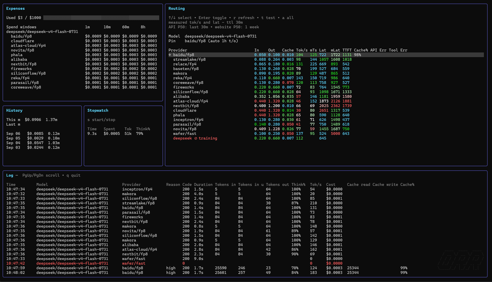

# orr

`orr` is a local OpenRouter proxy. It keeps the model selected by your client
and applies provider preferences from `providers.yaml` to generation requests.

It gives you provider routing, manual pins, live performance and spend data, and
a terminal dashboard without recording prompts or API keys.

> A valid OpenRouter API key is required. `orr` does not support keyless use.

## Quick start

Install from the public repository (Git is required, plus Go 1.23+ or Docker
with Buildx):

```sh
git clone https://github.com/mikael-titinovskii/orr.git
cd orr
./install.sh
orr serve
```

On Windows PowerShell:

```powershell
git clone https://github.com/mikael-titinovskii/orr.git
Set-Location orr
.\install.ps1
orr serve
```

The installer asks for `OPENROUTER_API_KEY`, builds `orr`, and adds it to
`PATH` where needed. Set `ORR_OPENROUTER_API_KEY` beforehand for unattended
installs. It also configures installed Kimi Code and OpenCode clients when it
finds them.

Without Go 1.23+, the installer builds `orr` for your platform with Docker and
the repository's `Dockerfile`. Docker is used only for building; `orr` still
runs directly on your machine.

Point any OpenAI-compatible client to:

```text
http://127.0.0.1:8787/v1
```

## Configure routing

Keep secrets and runtime options in `.env`; keep provider order and manual pins
in `providers.yaml`. Both are ignored by Git.

```dotenv
# .env
OPENROUTER_API_KEY=sk-or-...
ORR_LISTEN=127.0.0.1:8787
ORR_TUI=true
```

```yaml
# providers.yaml
version: 1
models:
  moonshotai/kimi-k3:
    order:
      - fireworks
      - deepinfra
    allow_fallbacks: false
```

The model key is its exact OpenRouter ID. Providers are tried in order.
`allow_fallbacks: false` prevents OpenRouter from using providers outside this
list. `orr` creates an empty entry for a new model and refreshes compatible
providers automatically.

Keep `ORR_LISTEN` on `127.0.0.1` unless you deliberately want network access.

## Everyday commands

| Command | Purpose |
| --- | --- |
| `orr serve` | Start the local proxy and dashboard. |
| `orr serve --no-tui` | Start the proxy and management API with plain logs. |
| `orr providers <model>` | List compatible OpenRouter providers. |
| `orr update` | Refresh provider orders for every known model. |
| `orr update --cache-only` | Keep only providers with prompt caching. |
| `orr reset` | Remove generated provider and stats state; preserves `.env`. |
| `orr upgrade` | Pull or download the latest source and rebuild the running binary with Go, or Docker when no usable Go toolchain is installed. |
| `orr completion <shell>` | Print completion setup for bash, zsh, fish, or PowerShell. |

Before tagging a release, update `Version` in `internal/app/main.go` to match
the tag. The dashboard compares this value with release tags, and `orr version`
reports it. After upgrading, restart `orr serve` to run the new executable.

Use a different dotenv file when needed:

```sh
orr serve --env ./local.env
orr update --max 3 --env ./local.env
```

Process environment variables override values from the dotenv file by default.
Use `--prefer-env-file` when the selected file should win for variables it
defines:

```sh
orr serve --prefer-env-file
orr update --env ./local.env --prefer-env-file
```

## Management API

`orr serve` also exposes a REST API at `http://127.0.0.1:8787/api/v1`, with or
without the dashboard. Local management requests require no authentication header.
ORR reads `OPENROUTER_API_KEY` through its existing environment/dotenv configuration
for upstream operations. Read stats and model/provider state, set or clear manual
pins, and submit provider refresh or benchmark jobs. Benchmark jobs make billable
upstream requests. Poll the job URL returned in the `Location` header.

See the [REST API specification](docs/rest-api.md) for endpoints, JSON fields,
examples, limits, and errors. Management changes share the dashboard's live
routing state and persist manual pins to `providers.yaml`.

The management API is accessible to anyone who can reach `ORR_LISTEN`, so keep
the default loopback address for local use.

While running, open [the API reference](http://127.0.0.1:8787/api/docs) or download
[OpenAPI JSON](http://127.0.0.1:8787/api/openapi.json) to import into an API client.
Both documentation endpoints are public and bundled into the binary, with no
CDN dependencies. The [schema source](internal/app/api_docs/openapi.json) is also
available in the repository.

## Dashboard

An interactive terminal opens the dashboard; redirected output uses plain logs.
Set `ORR_TUI=false` or pass `orr serve --no-tui` to always use plain logs.
The indicator beside Log spins while requests are in flight.



The useful controls are:

| Key | Action |
| --- | --- |
| `↑` / `↓` | Select a provider. |
| `Enter` | Toggle a manual pin for the selected provider. |
| `Tab` | Switch between recently used models. |
| `r` | Refresh and rank providers for the current model. |
| `t` | Benchmark the selected provider. |
| `a` | Benchmark every listed provider. |
| `s` | Start or stop the spend stopwatch. |
| `q` / `Ctrl+C` | Stop the proxy cleanly. |

The provider table includes OpenRouter's published `GPQA` Diamond and `Tau`
Airline benchmark scores, plus `Tool` and `Json` error rates. Benchmark
scores use OpenRouter's rolling 32-day window; error rates match the website's
one-week average of available daily percentages. `mApi` and `mTool`
continue to show errors observed by this proxy.
The legend above the table identifies token rates, latency in milliseconds, OpenRouter benchmarks, and
weekly average OpenRouter tool/JSON error rates, and measured API/tool error rates.
`Ts` and `Lat` show OpenRouter's throughput and latency; `mTs` and `mLat`
show measurements from this proxy.
The columns after `TTFT` are `GPQA`, `Tau`, `Tool`, `Json`, `mApi`, and
`mTool`. `GPQA` and `Tau` percentages are colored on the
same red–green–teal scale as throughput: higher scores are better, relative to
the listed providers for that model. The provider table shows the cache-read
price in `Cache`; cache-hit percentages are shown in the request log.
The table scrolls with provider selection to keep the selected provider's
metrics visible within the pane.
`mApi`, `mTool`, `Tool`, and `Json` use pale red for the lowest nonzero rates, increasing
to the current error red for the highest rates, comparing each column
independently. Equal nonzero rates use the strongest red.

These metrics load in the background, refresh every 15 minutes, and refresh
again after `r`. Missing data stays blank, and zero error rates stay blank.
Scores are matched to exact provider endpoints; ambiguous deployments stay
blank. The data comes from OpenRouter's website API, which can change separately
from its documented API. Fetch failures leave unavailable fields blank. The
metrics stay in memory and influence automatic benchmark selection as described below.
See [OpenRouter's Auto Exacto documentation](https://openrouter.ai/docs/guides/routing/auto-exacto)
for how the benchmarks and tool-call errors are measured.

Manual pins stay until removed. Automatic pins select the best measured
provider, expire after `ORR_PIN_TTL` (one hour by default), and can fail over
after provider-specific 429s or an unavailable endpoint.

Auto selection balances cost, speed, and quality. It estimates the cost and
duration of a typical request from recent traffic (or a reference request of
2,000 uncached input, 18,000 cached input, and 1,000 output tokens). Duration is
time to first token plus output tokens divided by measured tokens per second.
Providers within 1.5 times the field's median duration rank first, followed by
providers with complete prices and trustworthy first-token measurements.
Within these tiers, the lowest quality-adjusted cost-times-duration score wins.

GPQA, Tau, tool-call success, and JSON success contribute equally to quality.
GPQA and Tau are fractions; success is one minus the published error percentage
divided by 100. Missing or invalid metrics contribute a neutral 0.5. Their
average, `quality`, adjusts the score as
`cost * duration * (1.25 - 0.5 * quality)`, bounded to a 25% discount or penalty
on the cost-speed score. With all quality data missing, the multiplier is 1.
Quality cannot bypass latency tiers or provider health exclusions. A current
eligible automatic pin stays until a challenger improves the adjusted score
by at least 5%. Manual pins remain authoritative.

Quality data loads alongside provider benchmarks even without the dashboard,
shares a 15-minute cache with the dashboard, and uses the benchmark's remaining
deadline (at most 10 seconds). Automatic provider tests stop at 70% completion
or the three-second gate; quality fetching may use the rest of that gate before
selection. Unavailable or expired quality data uses the neutral adjustment.
Failed or cancelled fetches do not start a new cache lifetime: the next benchmark
can retry immediately, and the dashboard retries after 30 seconds. The dashboard
uses the shared data's original fetch timestamp. Pressing `r` invalidates quality
data, including results from fetches already in flight.

## Integrations

`orr integrate` updates Kimi Code and OpenCode after either client is installed.
You can also change only the OpenRouter base URL yourself.

Kimi Code uses the standalone `kimi` command and `~/.kimi-code/config.toml`
(or `$KIMI_CODE_HOME/config.toml` when that environment variable is set).
`orr integrate` creates missing configs for installed clients. A new or empty
Kimi config gets an OpenRouter provider with the configured `OPENROUTER_API_KEY`
and `moonshotai/kimi-k3` as its default model, with a 1,048,576-token context window.
The model alias is `openrouter/moonshotai/kimi-k3`, matching registry imports.
Existing Kimi configs keep their model selections and provider protocols; only
OpenRouter providers are patched. Anthropic providers use the proxy's host root
because their SDK adds `/v1/messages`; OpenAI-compatible providers use `/v1`.
For a provider named `openrouter` with type `openai`, integration also adds or
updates the registry `source` block and synchronizes its key with the configured
OpenRouter key (or the provider's existing `api_key`). Both installers run this
integration automatically. Other provider names and protocols retain their
existing setup because the registry declares `openrouter` with type `openai`.
If none exists, add OpenRouter using Kimi's
`/provider` command, select a model, then rerun `orr integrate`.

For an existing OpenRouter provider, its endpoint should be:

```toml
[providers.openrouter]
type = "openai"
base_url = "http://127.0.0.1:8787/v1"
```

The old Python Kimi CLI's `~/.kimi` directory and `KIMI_SHARE_DIR` are not targeted.
Unsupported OpenRouter provider protocols, including `openai_legacy`, `google-genai`,
and `vertexai`, are rejected without changing the file; current Kimi Code uses
`openai` for Chat Completions. Existing files are
backed up to `<config path>.orr-backup` before changes.

OpenCode (`~/.config/opencode/opencode.json`):

```json
{
  "provider": {
    "openrouter": {
      "options": { "baseURL": "http://127.0.0.1:8787/v1" }
    }
  }
}
```

Keep the client’s existing OpenRouter key and model selection. `orr` only adds
routing preferences for each selected model.

## Model registry for Kimi Code

`orr` serves the full OpenRouter model catalog in Kimi Code's models.dev-style
custom-registry format at:

```text
GET http://127.0.0.1:8787/registry.json
```

The document is keyed by the `openrouter` provider id and carries every model
OpenRouter publishes, with context size, max output tokens, tool-call and
reasoning support, input/output modalities, and reasoning efforts. It is fetched
from OpenRouter and cached for five minutes. Unknown token limits are omitted.
If a refresh fails or returns no usable models, the last valid catalog is served;
retries are limited to once every 30 seconds. Until a valid catalog is available,
upstream failures return HTTP 502.

The advertised API URL uses `ORR_LISTEN`, with wildcard bind addresses mapped to
loopback for local clients. Use a concrete address reachable by the client when
accessing the registry from another machine.

Point Kimi Code's OpenRouter provider at it so `/models` refresh auto-imports new
models instead of adding each one by hand. Run `orr integrate` to configure the
standard `openrouter` / `openai` provider, or add the block manually:

```toml
[providers.openrouter]
type = "openai"
base_url = "http://127.0.0.1:8787/v1"

[providers.openrouter.source]
kind = "apiJson"
url = "http://127.0.0.1:8787/registry.json"
apiKey = "sk-or-..."
```

Then run `/models` refresh (or `/reload`) in Kimi Code. Every OpenRouter model is
imported into `~/.kimi-code/config.toml`; the provider's `api_key` comes from
`source.apiKey`, so it must be non-empty.

## Runtime options

| Variable | Default | Purpose |
| --- | --- | --- |
| `ORR_TUI` | `true` | Enable the interactive dashboard. |
| `ORR_PIN_TTL` | `1h` | Lifetime of automatic pins. |
| `ORR_429_FAILOVER_THRESHOLD` | `2` | Consecutive provider 429s before automatic failover. |
| `ORR_LOG_REQUESTS` | `true` | Emit completed request lines in plain-log mode. |
| `ORR_UPDATE_MAX_PROVIDERS` | `20` | Maximum providers kept after a refresh. |
| `ORR_UPDATE_CACHE_ONLY` | `false` | Prefer only prompt-cache-capable providers. |

`OPENROUTER_API_KEY` also enables benchmarks, usage tracking, and account
metrics. Client requests still use the client’s own authorization header.

## Provider selection

`orr` compares healthy, tool-capable providers using estimated request cost and
measured response time. It favors the lowest cost-delay tradeoff, avoids
unusably slow choices, and keeps a small margin to prevent pin churn. Manual
pins always win.

Benchmarks make real, billable OpenRouter requests. The dashboard stores stats,
automatic pins, and benchmark results outside the repository; `orr reset`
removes that generated state.

## Development

```sh
go test ./...
go vet ./...
```

The end-to-end suite uses local mock upstreams and does not need a real OpenRouter
key or network access.

Build a binary for any supported platform without a local Go toolchain:

```sh
docker build --platform darwin/arm64 --output dist .
```

The result is `dist/orr` (`dist/orr.exe` for `windows/*` platforms).

Run the deterministic auto-selection snapshot tests with:

```sh
go test ./internal/app -run TestAutoSelectionSnapshots -v
```

Fixtures in `internal/app/testdata/auto_selection*_snapshots.json` declare
provider prices, measured speed and TTFT, quality metrics, pin state, and the
expected winner. Each scenario checks multiple provider listing orders and
repeated selection. The Kimi K3 screenshot fixture preserves missing measured
data; separate hypothetical cases explicitly assume benchmarks reproduce the
published throughput with 500 ms TTFT.
